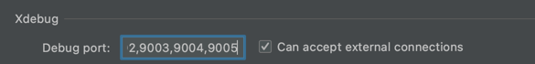
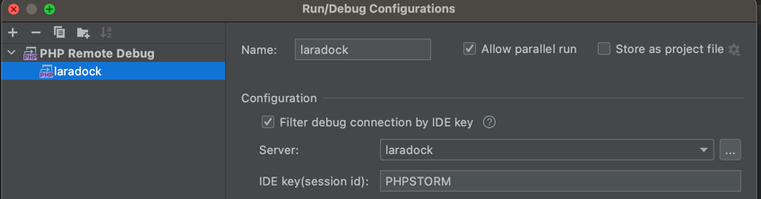
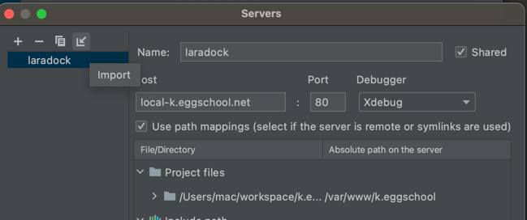

    

   
   
   
   <a href="https://github.com/laradock/laradock/stargazers">  </a>
   
   
   

<b>Full PHP development environment based on Docker.</b>

    

 
 

<h4 align="center" style="color:#7d58c2">Use Docker First - Learn About It Later!</h4>

	

## ENV Setting
- .env.example > .env 변경하여 사용하기

## 실행 명령어
- start : docker-compose up -d nginx mysql
  1. start 시 php-fpm 종류들 자동 실행
- stop : docker-compose stop
- build : docker-compose build nginx mysql php-fpm php-fpm7.0 php-fpm5.6
  1. 해당되는 컨테이너 build
  2. 캐시 옵션 여부 --no-cache

## nginx log
- ./logs/nginx/

## xdebug
- PHPSTORM Setting

